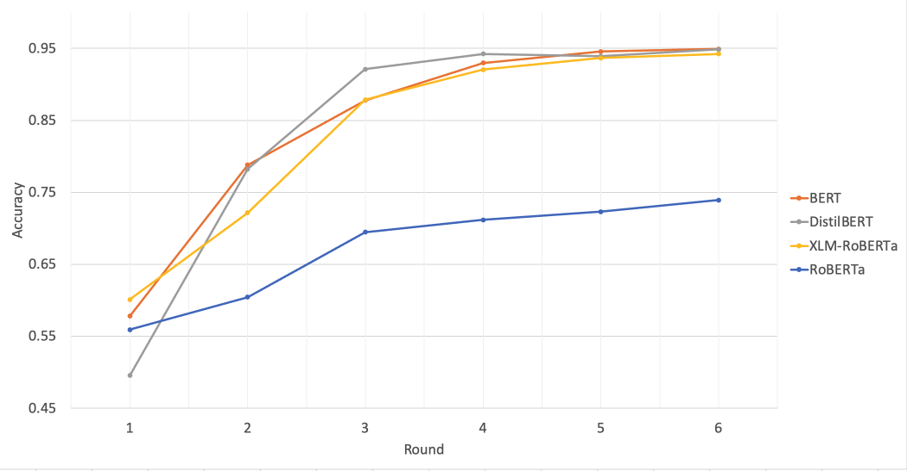
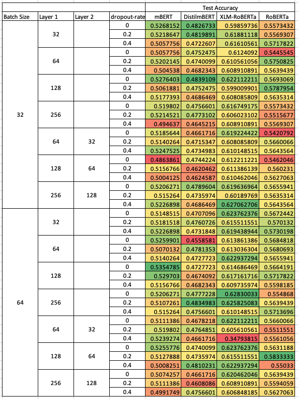

# Deep Learning for Natural Language Processing (ELEC0141) 23

## Abstract
This report focuses on the performance of four pre-trained models (BERT, DistilBERT, RoBERTa and XLM-RoBERTa) on a small dataset for textual entailment. By analysing the accuracy rates in both the training and testing phases, we found that XLM-RoBERTa performed relatively well. However, all models showed a significant drop in accuracy on the test set, suggesting the presence of overfitting. We also explore possible reasons affecting model performance, such as model architecture, number of parameters, pre-training strategy, hyperparameter settings and randomness factors. Finally, we suggest improvement directions to enhance the model's generalisation ability and performance on small datasets.

## How to use the code
- cd to thise folder in your Terminal
- For Windows type the following in your Terminal: `Models/run.sh`
- For Linux/Mac: `bash Models/run.sh`
- The dataset: https://www.kaggle.com/competitions/contradictory-my-dear-watson/data

**_!!!_** **Note**: On P100 GPU it will take approx 40 hours to train all files and on 3080Ti will take 20 hours.

## Ackownledgement
Special thanks to those Notebooks to help me build up my code:
- https://www.kaggle.com/code/anasofiauzsoy/tutorial-notebook
- https://www.kaggle.com/code/rohanrao/tpu-sherlocked-one-stop-for-with-tf
- https://www.kaggle.com/code/gazu468/all-about-bert-you-need-to-know
- https://www.kaggle.com/code/vbookshelf/basics-of-bert-and-xlm-roberta-pytorch#Section-1

## Requirment
- Python 3.8.5
- Numpy 1.22.3
- scikit-learn 0.24.0
- Transformer 4.28.1
- TensorFLow 2.4.0
- CUDA 11.0
- cuDNN version 8
- Pytorch 1.7.1
- torchvision 0.8.2
- Pandas 1.2

## Some Results

